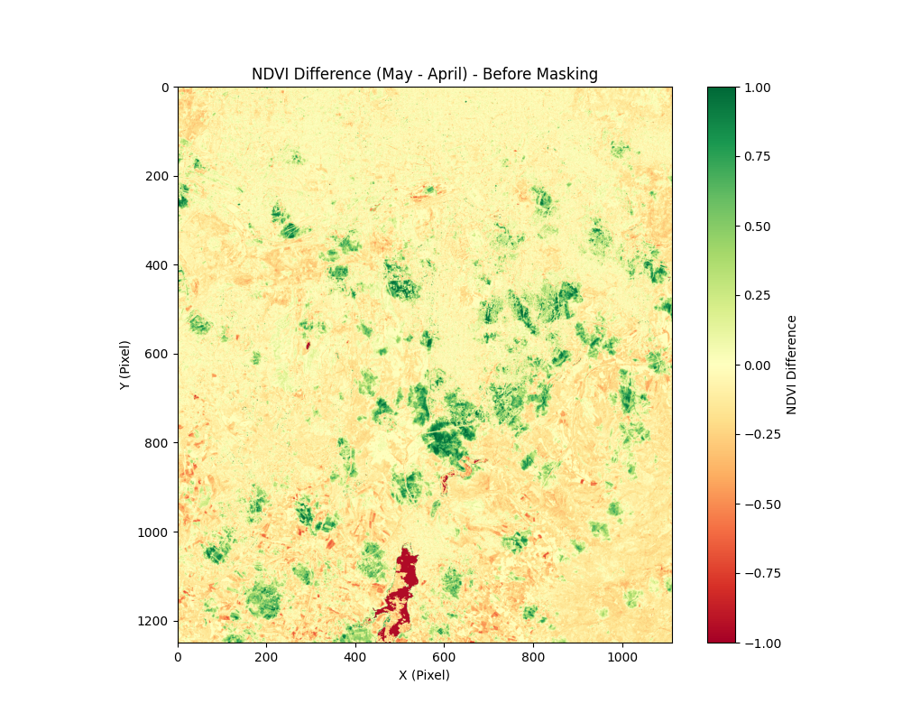
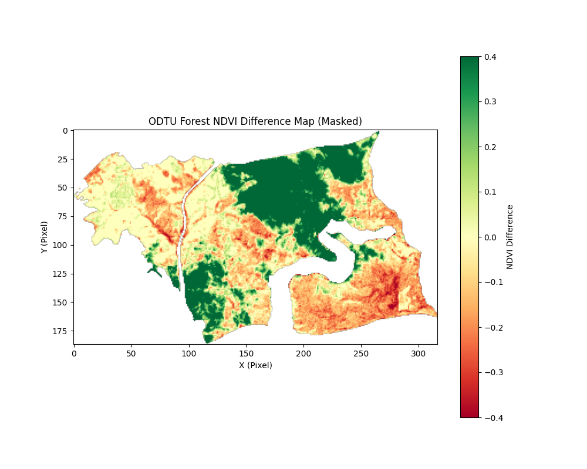
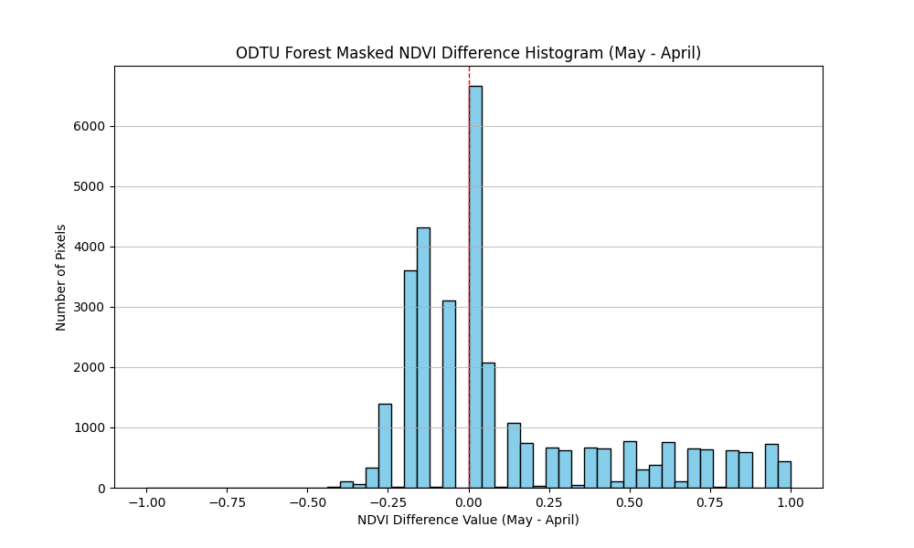
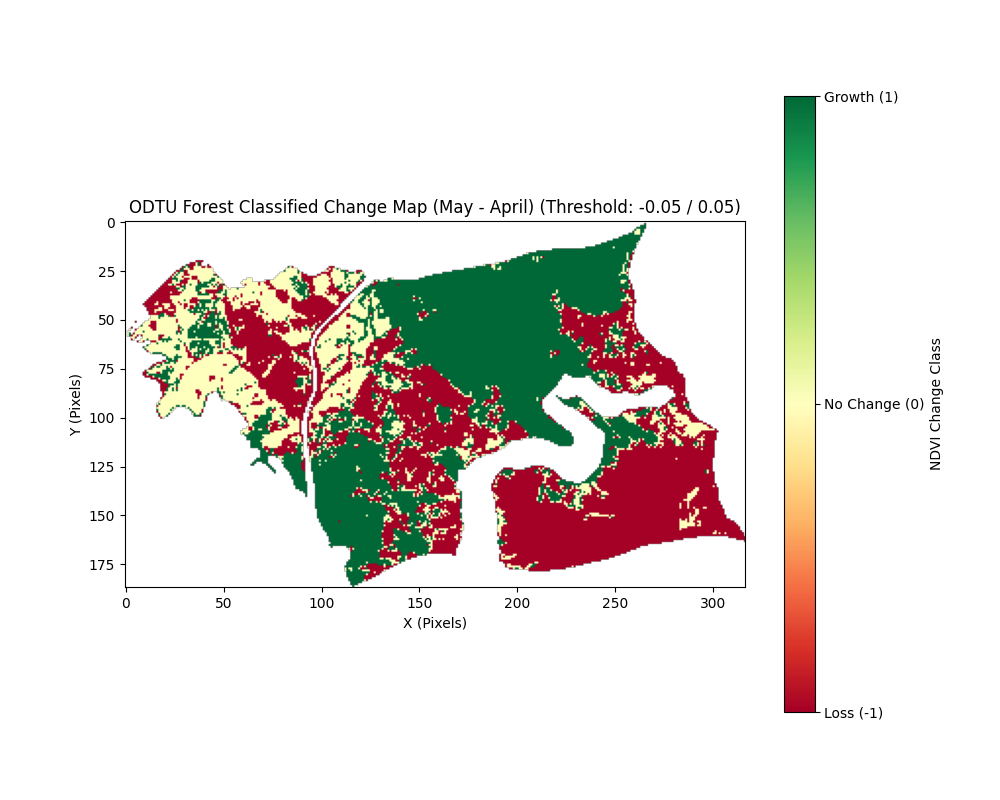

# metu-forest-ndvi-analysis

# METU Forest Vegetation Change Analysis using Sentinel-2 Imagery

This project performs a Normalized Difference Vegetation Index (NDVI) analysis on Sentinel-2 multispectral satellite images to quantify and map vegetation change (loss, growth, and no significant change) within the METU Forest between April 15, 2025, and May 15, 2025, including area calculations in hectares. This project is an Image Processing Pipeline.

## 1. Project Objective

The primary goals of this project are:
* To analyze multispectral satellite images (specifically Sentinel-2 L2A product) to understand vegetation dynamics.
* To calculate and interpret the Normalized Difference Vegetation Index (NDVI) using Near-Infrared (NIR) and Red spectral bands.
* To identify and visualize areas of vegetation change (loss, growth, and no significant change) within the METU Forest between April 15, 2025, and May 15, 2025.
* To quantify the areas of detected changes in hectares.
* To demonstrate an end-to-end image processing pipeline for remote sensing-based vegetation change detection.

## 2. Data Sets Used

This project utilizes the following data sets:

* **Satellite Imagery:** Sentinel-2 L2A product, specifically the Normalized Difference Vegetation Index (NDVI) bands, acquired from the Copernicus Open Access Hub (or Copernicus Browser).
    * **Bands Used:** Near-Infrared (NIR) and Red spectral bands were specifically utilized to calculate the Normalized Difference Vegetation Index (NDVI).
    * **Acquisition Dates:** Images from April 15, 2025, and May 15, 2025, were used to assess temporal changes.
    * **Acquisition Dates:** Images from April 15, 2025, and May 15, 2025, were used to assess temporal changes.
    * **Resolution:** Sentinel-2 imagery provides a 10-meter spatial resolution, allowing for detailed vegetation analysis.
    * These georeferenced TIFF files were loaded into NumPy arrays using the `rasterio` Python library for further processing.

* **METU Forest Boundary File:** A GeoJSON file (`METU_Forest_Boundary.geojson`) defining the precise geographical boundaries of the Middle East Technical University (METU) Forest.
    * This file was used to mask the satellite imagery, ensuring the analysis is strictly confined to the forest area.
    * This boundary data can typically be obtained from open-source mapping platforms like OpenStreetMap.

## 3. Methodology

This project implements an end-to-end image processing pipeline, structured into the following modular steps:

1.  **Data Acquisition and Preprocessing:**
    * **Satellite Image Selection:** Sentinel-2 L2A product images for April 15, 2025, and May 15, 2025, were sourced from the Copernicus Open Access Hub. These specific dates were chosen to ensure a precise one-month interval for accurate temporal change analysis. The images were downloaded as 32-bit float GeoTIFF files.
    * **Data Loading and Array Conversion:** The downloaded GeoTIFF files were loaded and converted into NumPy arrays using the `rasterio` library. A critical check was performed to ensure both April and May arrays had identical spatial dimensions (shapes) for pixel-wise comparison.
    * **NDVI Difference Calculation:** The Normalized Difference Vegetation Index (NDVI) difference was calculated by subtracting the April NDVI values from the May NDVI values (`NDVI_Difference = NDVI_May - NDVI_April`). This difference array serves as the primary indicator for vegetation change.
    * **Initial Visualization:** The raw NDVI difference array was visualized to get an initial understanding of the changes across the entire image extent, which revealed the presence of areas outside the METU Forest.

2.  **Geographical Masking and Refinement:**
    * **Forest Boundary Acquisition:** To focus the analysis solely on the METU Forest and prevent erroneous statistics from surrounding areas, a GeoJSON boundary file of the METU Forest was obtained (e.g., via Overpass Turbo or similar GIS sources).
    * **Precise Masking:** The calculated NDVI difference array was then precisely masked using the obtained GeoJSON boundary. This crucial step involved using `rasterio.mask` in conjunction with `rasterio.MemoryFile` to ensure accurate spatial alignment and prevent data inconsistencies. The masked areas outside the forest boundary were assigned a `NaN` (Not a Number) value.

3.  **Statistical Analysis and Thresholding:**
    * **Masked Data Statistics:** A statistical summary (min, max, mean, median, standard deviation) was generated for the masked NDVI difference array to understand the distribution of changes within the METU Forest.
    * **Histogram Generation:** A histogram of the masked NDVI difference values was plotted to visually inspect the distribution and aid in determining appropriate thresholds for change classification.
    * **Change Classification Thresholding:** Based on the statistical distribution and visual inspection of the histogram, a threshold of `0.05` was set to classify changes:
        * **Loss (-1):** NDVI difference below `-0.05` (indicating a decrease in vegetation health).
        * **No Significant Change (0):** NDVI difference between `-0.05` and `0.05` (indicating minimal vegetation change).
        * **Growth (1):** NDVI difference above `0.05` (indicating an increase in vegetation health).

4.  **Area Calculation and Visualization:**
    * **Area Quantificiation:** For each classified change category (Loss, No Significant Change, Growth), the corresponding areas were calculated in hectares, considering the 10x10 meter spatial resolution of Sentinel-2 pixels.
    * **Final Visualization:** The classified change map was visualized, using distinct colors to represent each category, providing a clear spatial representation of vegetation dynamics within the METU Forest.
  

## 4. Findings

The analysis of Sentinel-2 NDVI data for the METU Forest between April 15, 2025, and May 15, 2025, yielded the following key findings:

* **Initial Challenges & Refinement:** Early results showed unexpected values across the entire image. Through visualization, it was identified that areas outside the METU Forest significantly skewed the statistical calculations. This led to the crucial decision to precisely mask the imagery using the METU Forest's GeoJSON boundary, ensuring the analysis was strictly confined to the area of interest.

* **Quantified Vegetation Change (Masked Data):**
    * **Total Analyzed Area:** Approximately 323.10 hectares.
    * **Vegetation Loss (NDVI Difference < -0.05):** A significant area of **129.73 hectares**, representing approximately **40.1%%** of the METU Forest, exhibited a decrease in NDVI values.
    * **No Significant Change (-0.05 <= NDVI Difference <= 0.05):** An area of **66.62 hectares**, approximately **20.6%%**, showed minimal change in NDVI.
    * **Vegetation Growth (NDVI Difference > 0.05):** An area of **126.75 hectares**, approximately **39.2%%**, showed an increase in NDVI values.

   

* **Interpretation of Significant Loss:** The observed high percentage of vegetation loss (approximately **[LOSS_PERCENTAGE]%**) within a single month (April to May) is unusual for a typical spring green-up period in the region. **Normally, during this transition from April to May, one would expect a general increase in NDVI values, indicating robust vegetation growth and greening.**

    However, this finding is strongly correlated with, and most likely attributed to, **anomalous climatic conditions experienced in Ankara during mid-April 2025 (specifically around April 11th and subsequent days), characterized by widespread snowfall and unusually low temperatures.** The 15 April 2025 Sentinel-2 image likely captures the immediate aftermath or lingering effects of these severe weather events.

    This anomaly resulted in the 15 April NDVI values being **significantly lower than expected** for that time of year, due to factors like snow cover, vegetation stress, or a delayed onset of growth. While the 15 May image shows some recovery (as reflected in the 'Growth' areas), in a substantial portion of the forest, the vegetation either did not fully recover to expected spring levels or still exhibited signs of stress, leading to a negative NDVI difference (NDVI_May - NDVI_April < -0.05). This suggests that the **"loss" is not necessarily a permanent damage but rather a strong indicator of temporary climatic stress and a deviation from the typical seasonal vegetation progression.**

* **Further Considerations:** While the direct impact of the April snow is the primary suspected cause, it is important to acknowledge that other factors such as residual cloud cover, atmospheric variability, or sensor artifacts (though minimized by L2A product) could also contribute to observed NDVI differences. However, the strong correlation with reported weather events makes climatic stress a highly probable explanation for the magnitude of the observed "loss."

## 5. Visualizations

This section presents the key visual outputs generated during the analysis, illustrating the various stages of the NDVI change detection pipeline.

### NDVI Difference Map (Before Masking)

This initial visualization displays the raw NDVI difference (May - April) across the entire Sentinel-2 scene, before applying the METU Forest mask. It highlights the need for spatial masking to focus the analysis on the area of interest and avoid extraneous data.

 ### Masked METU Forest NDVI Difference Map

This map shows the NDVI difference specifically within the METU Forest boundaries after the masking operation. Red areas indicate a decrease in vegetation health, green areas indicate growth, and yellow areas represent minimal change.

### Histogram of Masked NDVI Difference

The histogram visualizes the distribution of NDVI difference values exclusively within the masked METU Forest area. This plot was crucial for determining the thresholds used for classifying vegetation change (Loss, No Significant Change, Growth). The red dashed line indicates the 0.0 threshold.

### Classified METU Forest Change Map

This final classification map categorizes the METU Forest into areas of "Loss" (red), "No Significant Change" (yellow), and "Growth" (green), based on the defined NDVI difference thresholds. This visualization provides a clear overview of vegetation dynamics between April and May 2025.

## 6. Future Enhancements

This project provides a foundational NDVI change analysis. The following enhancements could be considered for future development to further improve the analysis and extend its capabilities:

* **Expanded Temporal Analysis:** Extend the analysis to cover a longer period (e.g., multiple years or seasons) to identify long-term trends, seasonal variations, and more subtle changes in vegetation health. This would involve processing a time series of satellite images.
* **Incorporation of Diverse Indices:** Beyond NDVI, explore the use of other relevant vegetation indices (e.g., EVI, SAVI) or biophysical parameters to gain a more comprehensive understanding of vegetation status and change.
* **Integration of External Data:** Incorporate additional data sources such as detailed meteorological data (temperature, precipitation, specific weather events like snowfall) to better correlate observed vegetation changes with environmental factors. This would enhance the explanatory power of the analysis.
* **Advanced Analytical Techniques:** Investigate the application of more advanced statistical or machine learning approaches for change detection. This could involve exploring techniques that are more robust to noise and capable of identifying complex change patterns.
* **Interactive Visualization:** Develop interactive web-based maps for the analysis results (e.g., using libraries like Folium or Dash). This would allow users to explore the data dynamically and gain deeper insights.
* **Scalability for Larger Areas:** Adapt the processing pipeline to handle larger geographic areas or higher volumes of data, potentially by leveraging cloud-based geospatial platforms. This would enable broader environmental monitoring initiatives.
